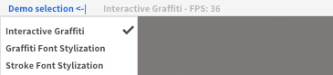
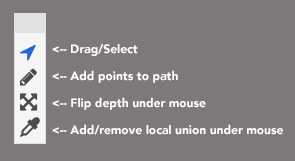
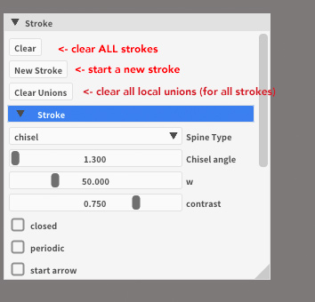
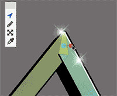

# Strokestyles testbed 
Interactive stroke-based stylization and layering app. 

The project currently compiles on OSX only, and requires [cmake](https://cmake.org) to build. 
The compiled executable is not a bundle and needs to be run from the terminal.

## Dependencies and installation
Follow the instructions in the [INSTALL.md](https://github.com/autograff-devel/strokestyles/blob/master/INSTALL.md) file to install this and the other projects in the strokestyles system (including segmentation). 
Otherwise, this application can be run standalone with the same dependencies required to install the  [cutograff](https://github.com/autograff-devel/cautograff) library, which is statically linked and will be compiled with the executable.

It is assumed that the [strokestyles_interactive_demos](https://github.com/autograff-devel/strokestyles_interactive_demos) repository, of which this application is a part, has been cloned at the same directory level as the [cutograff](https://github.com/autograff-devel/cautograff) library. If this should not be the case, the 
`CAUTOGRAFF_DIR` variable in the [CMakeLists.txt](https://github.com/autograff-devel/strokestyles_interactive_demos/blob/main/strokestyles_testbed/CMakeLists.txt) file must be edited appropriately. 

### Compiling and running
To compile the application, navigate to the `strokestyles_interactive_demos/strokestyles_testbed` directory and:
```
mkdir build; cd build
cmake ..
make -j4
```
With `-j` followed by the number of cores on your machine.

To execute the app, navigate to the `bin` directory and:
```
./strokestyles_testbed
```

## Demos
Tha application has a top menu (in the window):


 
 which allows to select between different demos. 
 
The demo source files are headers in the `./demos/` directory. 
Demo paramters are automatically saved as XML files in the `./bin/data/configurations/` directory.

The app currently contains the following demos:

### "Interactive Graff"
Demonstrates stroking and layering. 
The demo has a floating toolbar that can be used to edit strokes


Select the pencil tool and click to add stroke points. When a new stroke is created, its paramters will appear in a "Stroke" window.



Use the arrow tool to drag point, or to adjust smoothness by dragging the handles



### "Stroke Font Stylization" and "Graffiti Font Stylization"
Demonstrate font stylization. These demos require font/svg segmentation data to operate. Pre-segmented glyph data can be downloaded for pre-segmented fonts at the this [address](https://www.dropbox.com/s/cnd0wu3gk2vmghd/glyph_data.zip?dl=0).

The zip file contains a directory `glyph_data`. The simplest way to use the pre-segmented glyphs is to copy the contents of the unzipped directory into the `apps/strokestyles_testbed/bin/data/glyph_data` directory.  Otherwise you can manually set the glyph directory from the application by selecting the **Options** menu (at the top of the app window) and then **Set glyph database** item.

Custom stroke segmentations can be generated using the
 [strokestyles](https://github.com/autograff-devel/strokestyles) Pyhon scripts.
 The output segmentations can be used directly in the app by selecting the
 `data/glyphs` directory where these are generated by the segmentation script.

### "Interactive Calligraphy"
Demonstrates smoothing and brush rendering.

# Project dependency details
While it is suggested to follow the instructions in 
[INSTALL.md](https://github.com/autograff-devel/strokestyles/blob/master/INSTALL.md), this project only depends on statically linked files from [cutograff](https://github.com/autograff-devel/cautograff) and  on the following non-default libraries, which can be installed through the packager manager of choice:

- [boost](https://www.boost.org) For graphs and some additional utilities.
- [OpenCV 4](https://opencv.org) For imaging
- [armadillo](http://arma.sourceforge.net) (compiled with LAPACK and BLAS) For linear algebra

With [Anaconda](https://anaconda.org) these can be installed with:
```
conda install -c conda-forge armadillo
conda install -c conda-forge opencv
conda install -c conda-forge boost 
```
And cmake with
```
conda install -c conda-forge cmake 
```

Equivalent procedures exist for Homebrew as well. 

### Internal dependencies
Other dependencies that are included in the repository include [Dear IMGUI](https://github.com/ocornut/imgui) (for the UI, using the [Adobe fork](https://github.com/adobe/imgui), with a small tweak), [gfx-ui](https://github.com/colormotor/gfx_ui) (for geometry interaction), [GLFW3](https://github.com/glfw/glfw) (for OpenGL contexts and windowing), and others.
